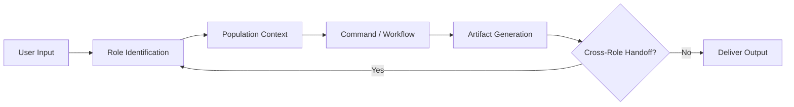
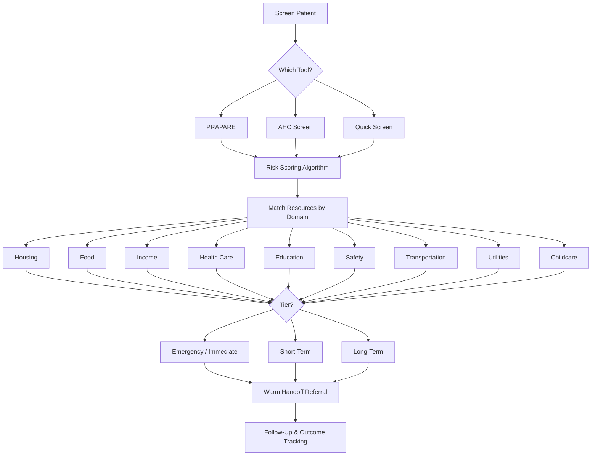
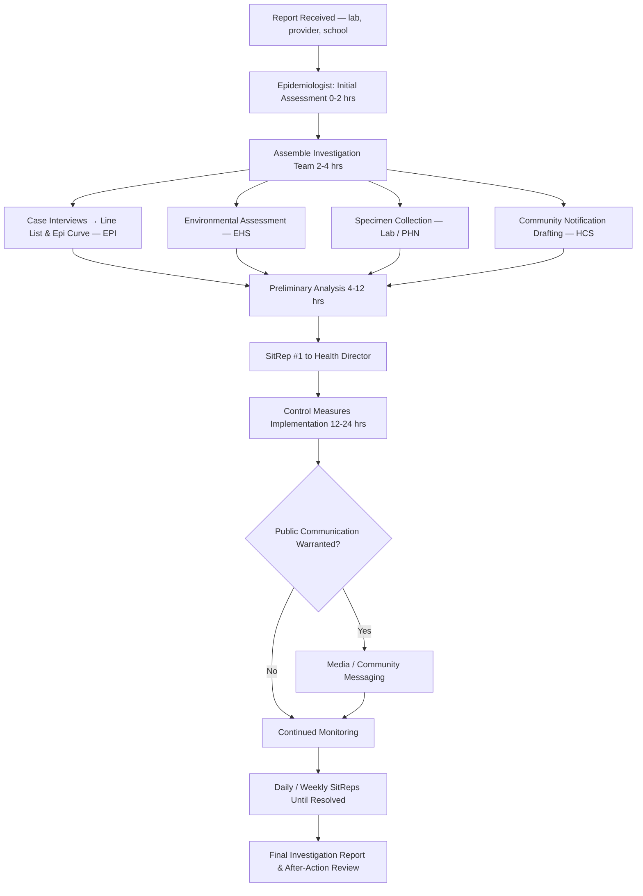
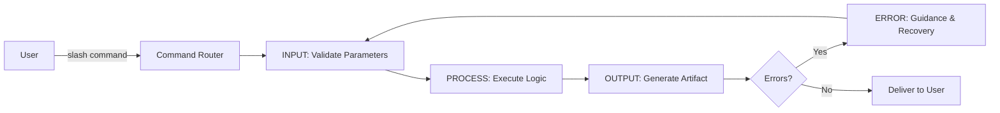

# Access to Health

**Comprehensive AI Operating System for Public Health Professionals**

Part of the [CoTrackPro "Access To" Initiative](https://github.com/CoTrackPro) — open-source civic resource systems for justice, education, housing, services, peace, safety, and health.

---

## What This Is

A complete operating system for public health — not just a reference library. Routes professionals by role, loads population-specific guidance, executes workflows via slash commands, and generates artifacts from screening results to board presentations.

**20 roles. 25 populations (10 with deep dives). 50 eval cases. 25 slash commands with full implementation. 10 MCP tools. 60+ reporting and communication artifacts. Bilingual Spanish layer. 42 AI prompts. 10 SOPs. 8 cross-role workflows with decision trees. 52-week engagement calendar.**

Missouri reference implementation. Nationally applicable.

## Who It's For

| Role | Entry Point |
|---|---|
| **Epidemiologist** | `roles/epi.md` → 5 workflows from daily surveillance to outbreak investigation |
| **Community Health Worker** | `roles/chw.md` → Navigation, screening, home visits, care coordination |
| **Public Health Nurse** | `roles/phn.md` → Immunization, maternal/child, chronic disease, school health |
| **Health Director** | `roles/hdo.md` → Strategy, emergency authority, budget, workforce, governance |
| **Behavioral Health Clinician** | `roles/priority-roles.md` → Assessment, crisis, integrated care, groups |
| **Environmental Health Specialist** | `roles/priority-roles.md` → Inspections, hazard investigation, lead, water |
| **Health Educator** | `roles/remaining-roles.md` → Program design, workshops, CE, health literacy |
| **Communications Specialist** | `roles/priority-roles.md` → Campaigns, media, crisis comms, social media |
| **Program Manager** | `roles/priority-roles.md` → Operations, grants, supervision, evaluation |
| **Data Analyst** | `roles/remaining-roles.md` → Dashboards, data quality, reporting, analytics |
| **Policy Advocate** | `roles/remaining-roles.md` → Legislative tracking, HIA, coalitions, HiAP |
| **All 20 roles** | `roles/ROLE-REGISTRY.md` → Full index with pod structure and routing |

## How It Works

### System Routing Loop



### Role Pod Structure

```mermaid
flowchart TD
    R[20 Public Health Roles] --> P1[Surveillance Pod]
    R --> P2[Community Pod]
    R --> P3[Clinical Pod]
    R --> P4[Behavioral Health Pod]
    R --> P5[Maternal-Child Health Pod]
    R --> P6[Education Pod]
    R --> P7[Environment Pod]
    R --> P8[Policy & Leadership Pod]
    R --> P9[Operations Pod]

    P1 --> P1a[Epidemiologist]
    P1 --> P1b[Disease Intervention Specialist]
    P1 --> P1c[Data Analyst]
    P2 --> P2a[Community Health Worker]
    P2 --> P2b[Community Engagement Specialist]
    P3 --> P3a[Public Health Nurse]
    P3 --> P3b[Oral Health Coordinator]
    P4 --> P4a[Behavioral Health Clinician]
    P4 --> P4b[Substance Use Prevention]
    P5 --> P5a[MCH Specialist]
    P5 --> P5b[Nutritionist]
    P6 --> P6a[Health Educator]
    P6 --> P6b[School Health Coordinator]
    P7 --> P7a[Environmental Health Specialist]
    P8 --> P8a[Health Director]
    P8 --> P8b[Policy Advocate]
    P9 --> P9a[Program Manager]
    P9 --> P9b[QI Coordinator]
```



### SDOH Screening and Navigation Flow



### Cross-Role Workflow: Disease Outbreak Response



### Command Execution Model



## File Structure

```
access-to-health/                        46 files │ ~80,000 words
├── SKILL.md                             Lean routing hub (progressive disclosure)
├── README.md                            This file
├── AUDIT.md                             Gap analysis and build plan
│
├── roles/                               20 PUBLIC HEALTH ROLES
│   ├── ROLE-REGISTRY.md                 Index, pods, routing logic
│   ├── epi.md                           Epidemiologist (deep)
│   ├── chw.md                           Community Health Worker (deep)
│   ├── phn.md                           Public Health Nurse (deep)
│   ├── hdo.md                           Health Director (deep)
│   ├── priority-roles.md               BHC, EHS, MCH, HCS, PMG, EPC
│   ├── remaining-roles.md              DIS, NUT, SUP, SHC, OHC, CES, QIC, DAT, POL, HED
│   └── all-roles.md                     Original 18-role reference
│
├── populations/                         25 POPULATIONS + 10 DEEP DIVES
│   ├── POPULATION-REGISTRY.md           Master registry
│   └── deep-dives/
│       ├── black-african-american.md    Full deep dive (disparities, history, culture, engagement)
│       └── all-deep-dives.md            Hispanic, Pregnant, Homeless, PWUD, Immigrant, LGBTQ+,
│                                         Older Adults, Justice-Involved, Rural
│
├── workflows/                           8 CROSS-ROLE WORKFLOWS
│   ├── cross-role-workflows.md          Original summaries
│   └── cross-role-workflows-expanded.md Decision trees, timelines, templates, escalation
│
├── commands/                            25 SLASH COMMANDS
│   ├── COMMANDS.md                      Command reference
│   └── COMMAND-SPECS.md                 Full INPUT→PROCESS→OUTPUT→ERROR specs
│
├── communication/                       INTERNAL + EXTERNAL COMMUNICATION
│   ├── internal-playbook.md             Staff, leadership, governance, interagency, frameworks
│   └── external-playbook.md             Media, digital, regulatory, community presentations
│
├── artifacts/                           60+ REPORTING ARTIFACTS
│   ├── reporting-templates.md           40+ report templates (surveillance, grants, community, etc.)
│   └── role-artifacts.md                13 role-specific document templates
│
├── features/                            CORE FEATURES
│   ├── sdoh-screener.md                 PRAPARE/AHC/Quick Screen + workflow
│   ├── resource-navigator.md            9 domains × 3 tiers + MO resources
│   ├── advocacy-toolkit.md              Scripts, testimony, coalition, media
│   └── education-toolkit.md             5 modules (CE, community, career, PH 101, TTT)
│
├── messaging/                           CAMPAIGNS + CONTENT
│   ├── campaign-builder.md              6 campaigns + planning framework
│   ├── social-media-library.md          27 posts, 9 categories, hashtag strategy
│   ├── trust-rebuilding-playbook.md     Local proxy model, HEAR framework, prebunking
│   └── email-sequences.md              8 lifecycle sequences (30 total emails)
│
├── references/                          KNOWLEDGE BASE
│   ├── apha-knowledgebase.md            23 APHA topic areas synthesized
│   ├── apha-url-index.md               Live URL index for runtime PDF ingestion
│   ├── fiscal-crisis-brief.md           5-pillar Unified Health Blueprint
│   ├── funding-guide.md                 Federal/state/foundation funding sources
│   └── missouri-public-health.md        MO infrastructure, St. Louis data, programs
│
├── bilingual/                           SPANISH LAYER
│   └── spanish-layer.md                 Screening scripts, resource phrases, cultural concepts,
│                                         promotora model, social media, language access
│
├── mcp/                                 MCP INTEGRATION
│   └── MCP-SCHEMA.md                    10 tool schemas + connector integration map
│
├── evals/                               EVALUATION
│   └── EVAL-SUITE.md                    50 test cases across 5 categories
│
├── scripts/                             OPERATIONS
│   └── team-sops.md                     10 SOPs
├── schemas/                             DATA
│   └── sdoh-data-model.json             5-table HIPAA-ready schema
├── templates/                           GRANT + POLICY
│   └── grant-and-policy-templates.md    LOI, narrative, logic model, budget, brief, resolution
├── tools/                               DEVELOPER
│   ├── sdoh-score.ts                    TypeScript SDOH risk scoring
│   ├── campaign-generator.ts            AI campaign engine
│   └── apha-fetcher.js                  Node.js PDF ingestion
└── assets/                              REFERENCE
    ├── ai-prompt-library.md             42 production prompts
    ├── data-reference.md                Key statistics + MO data
    └── engagement-calendar.csv          52-week calendar
```

## The "Access To" Family

| Pillar | Repo | Status |
|---|---|---|
| Justice | access-to-justice | Complete |
| Education | access-to-education | Complete (69 files, 120K words) |
| Housing | access-to-housing | Complete |
| Services | access-to-services | Complete |
| Peace | access-to-peace | Complete |
| Safety | access-to-safety | Complete |
| **Health** | **access-to-health** | **Complete (46 files, ~80K words)** |

## License

MIT — Use freely. Attribution appreciated.

## Contact

Doug Devitre — [cotrackpro.com](https://cotrackpro.com) — dougdevitre@gmail.com
