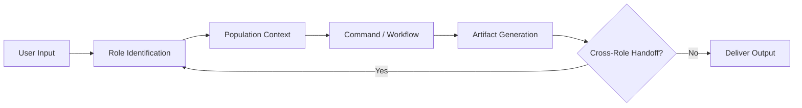

# Access to Health

**Comprehensive AI Operating System for Public Health Professionals**

Part of the [CoTrackPro "Access To" Initiative](https://github.com/CoTrackPro) — open-source civic resource systems for justice, education, housing, services, peace, safety, and health.

---

## What This Is

A complete operating system for public health — not just a reference library. Routes professionals by role, loads population-specific guidance, executes workflows via slash commands, and generates artifacts from screening results to board presentations.

**20 roles. 25 populations. 10 deep dives. 50 eval cases. 25 slash commands. 10 MCP tools. 60+ reporting artifacts. Bilingual Spanish layer. 42 AI prompts. 10 SOPs. 8 cross-role workflows. 52-week engagement calendar. Cross-sector integration for developers, city planners, accountants, government, and technology companies.**

Missouri reference implementation. Nationally applicable.

## Quick Start

=== "Public Health Professional"

    1. [Find your role](roles/ROLE-REGISTRY.md) — 20 roles across 9 pods
    2. [Load your population](populations/POPULATION-REGISTRY.md) — 25 populations with guidance
    3. [Run a command](commands/COMMANDS.md) — 25 slash commands for common tasks
    4. [Generate an artifact](artifacts/reporting-templates.md) — 60+ templates

=== "Developer / Engineer"

    1. [Architecture & APIs](integration/developer-guide.md) — FHIR R4, SMART on FHIR, compliance
    2. [Data Standards](integration/cross-sector-data-standards.md) — Gravity Project, open data APIs
    3. [Schemas](integration/cross-sector-data-standards.md) — SDOH data model + FHIR mapping
    4. [Tools](integration/developer-guide.md) — TypeScript SDOH scorer, ROI calculator, campaign engine

=== "City Planner"

    1. [Planning & Health](integration/city-planning-health.md) — HIA, zoning, transportation, parks
    2. [Health Data](assets/data-reference.md) — Statistics for planning decisions
    3. [Missouri Context](references/missouri-public-health.md) — Local data and organizations

=== "Accountant / CFO"

    1. [Fiscal Operations](integration/fiscal-operations.md) — ROI, CBA, audit, Medicaid billing
    2. [Grant Templates](grant-templates/grant-and-policy-templates.md) — LOI, narrative, budget
    3. [Funding Sources](references/funding-guide.md) — Federal, state, foundation

=== "Government Official"

    1. [Government Toolkit](integration/government-toolkit.md) — Legislation, constituent comms, HiAP
    2. [Advocacy Toolkit](features/advocacy-toolkit.md) — Testimony, briefs, coalitions
    3. [Policy Templates](grant-templates/grant-and-policy-templates.md) — Briefs, resolutions

=== "Technology Company"

    1. [Vendor Guide](integration/health-tech-vendor-guide.md) — Procurement, compliance, partnerships
    2. [Data Standards](integration/cross-sector-data-standards.md) — Interoperability requirements
    3. [MCP Tools](mcp/MCP-SCHEMA.md) — 10 AI tool schemas

## Core Loop

## The 10 Guardrails

Every piece of content in this system follows these guardrails:

1. **Evidence-based** — Cite APHA, CDC, WHO, or peer-reviewed sources
2. **Trauma-informed** — No blame, shame, or stigmatizing language
3. **Equity lens** — Structural framing. Disaggregate all data by race, ethnicity, income, geography
4. **Culturally responsive** — Adapt to community context
5. **Politically neutral** — Health outcomes, not partisan positions
6. **Privacy-first** — HIPAA / 42 CFR Part 2 compliant
7. **Plain language** — 6th-grade reading level for public-facing content
8. **Person-first** — "Person with diabetes" not "diabetic"
9. **Community voice** — Nothing about us without us
10. **Missouri reference, nationally applicable**

## License

MIT — Use freely. Attribution appreciated.

Doug Devitre — [cotrackpro.com](https://cotrackpro.com) — <dougdevitre@gmail.com>
