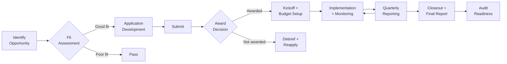

# Fiscal Operations — ROI, Cost-Benefit, Budgeting, and Audit

> For accountants, CFOs, budget analysts, grant fiscal managers, and auditors
> Making the financial case for public health — and managing the money responsibly

### Grant Lifecycle Flow



---

## Public Health ROI — The Financial Case

### Prevention ROI Summary

| Investment | Return per $1 | Source | Timeframe |
|-----------|---------------|--------|-----------|
| Childhood immunization | $10.90 saved | CDC | Per cohort |
| WIC (nutrition) | $1.77–$3.13 saved | USDA/ERS | Per participant per year |
| Lead poisoning prevention | $17–$221 saved | Pew/HBEP | Lifetime per child |
| Community health workers | $2.47 saved | ASTHO | Per year per CHW |
| Tobacco cessation | $1.26 saved | CDC | Per participant per year |
| Home visiting (NFP) | $5.70 saved | RAND | Per family through child age 15 |
| Diabetes Prevention Program | $2,650 per QALY | CDC/CMS | Per participant |
| Water fluoridation | $32 saved per $1 | CDC | Per person per year |
| School sealant program | $11.70 saved | CDC | Per sealed tooth |
| Naloxone distribution | $166 saved per $1 | ASTHO | Per kit distributed |

### Cost of Inaction

| Condition | Annual Cost (US) | Per Case Cost | Preventability |
|-----------|-----------------|---------------|---------------|
| Heart disease | $229 billion | $18,953 avg hospitalization | 80% of premature CVD preventable |
| Diabetes | $327 billion | $16,752/year per person | Type 2 largely preventable |
| Obesity | $173 billion | $1,861 more per year than normal weight | Addressable through policy and environment |
| Tobacco | $300 billion | $170 billion in direct medical costs | Preventable — cessation is cost-effective |
| Opioid crisis | $1.5 trillion | $72,000 per overdose death (economic) | Harm reduction + treatment is cost-effective |
| Food insecurity | $160 billion | $1,834 more in healthcare per year | SNAP reduces food insecurity by 30% |
| Lead poisoning | $50 billion | $35,000 lifetime cost per affected child | Prevention costs <5% of treatment |
| Preterm birth | $26 billion | $65,000+ per preterm infant (first year) | Doula programs reduce preterm by 30% |

**Key message for budget hearings**: "Public health spending is the cheapest healthcare spending. Every dollar prevents many more in downstream costs."

---

## Public Health Budget Structure

### Typical Revenue Sources

| Source | % of Budget | Stability | Notes |
|--------|-------------|-----------|-------|
| **Federal grants** | 30-50% | Low (competitive, cyclical) | CDC, HRSA, SAMHSA, USDA. 1-5 year awards |
| **State funding** | 15-25% | Medium | General revenue + pass-through federal |
| **Local tax revenue** | 15-30% | High | Property tax, sales tax, dedicated health levy |
| **Fees and permits** | 5-15% | High | Environmental health inspections, licenses |
| **Medicaid billing** | 2-10% | Medium | CHW services, case management, clinical services |
| **Foundation grants** | 2-5% | Low | Project-specific, 1-3 year terms |
| **Contracts** | Variable | Medium | Hospital partnerships, Medicaid MCO, academic |

**Diversification target**: No single source >30% of operating budget. See `references/fiscal-crisis-brief.md`.

### Standard Budget Categories

```
EXPENDITURE BUDGET — [Health Department] — FY [Year]

A. PERSONNEL (typically 60-75% of total)
   A1. Salaries and wages
   A2. Fringe benefits (FICA, health insurance, retirement, workers comp)
   A3. Temporary/contract staff

B. OPERATING
   B1. Supplies (clinical, office, educational materials)
   B2. Travel (local mileage, conferences)
   B3. Equipment (>$5,000 threshold for capitalization)
   B4. Contractual services (IT, evaluation, interpretation)
   B5. Occupancy (rent, utilities, maintenance)
   B6. Communications (phone, internet, postage)
   B7. Insurance (professional liability, general)

C. PROGRAM
   C1. Client services (medications, lab tests, incentives)
   C2. Community engagement (advisory board compensation, event costs)
   C3. Training and professional development
   C4. Printing and materials production

D. CAPITAL
   D1. Facility improvements
   D2. Vehicles
   D3. Major equipment

E. INDIRECT COSTS
   E1. Federally negotiated rate × modified total direct costs
   E2. (Or 10% de minimis if no negotiated rate)

TOTAL EXPENDITURES
```

---

## Grant Financial Management

### Grant Fiscal Compliance Checklist

**Pre-Award**:
- [ ] UEI (Unique Entity Identifier) active in SAM.gov
- [ ] Indirect cost rate agreement current (or use 10% de minimis)
- [ ] Cost allocation plan for shared costs
- [ ] Time and effort reporting system in place
- [ ] Subrecipient vs. contractor determination documented
- [ ] Audit current (Single Audit if >$750K federal expenditures)

**Award Management**:
- [ ] Award terms and conditions reviewed by fiscal AND program staff
- [ ] Budget set up in accounting system matching award categories
- [ ] Drawdown schedule established (advance or reimbursement)
- [ ] Reporting calendar created (interim, annual, final reports)
- [ ] Cost share/match documented (if required)
- [ ] Prior approval matrix understood (which costs need funder approval)

**Ongoing Monitoring**:
- [ ] Monthly budget vs. actual review
- [ ] Burn rate tracking (are you spending too fast or too slow?)
- [ ] Time and effort certifications signed (semi-annually minimum)
- [ ] Subrecipient monitoring per 2 CFR 200
- [ ] Cost reasonableness documentation maintained
- [ ] Procurement follows 2 CFR 200.318-326

**Closeout**:
- [ ] Final expenditures within award period
- [ ] Final financial report (SF-425 for federal)
- [ ] Final program report submitted
- [ ] Equipment disposition documented
- [ ] Records retention (3 years from final report — or longer if audit pending)
- [ ] Excess funds returned

### Common Audit Findings (and How to Avoid Them)

| Finding | Prevention |
|---------|-----------|
| **Unallowable costs** | Review 2 CFR 200.421-475 for cost allowability. When in doubt, ask |
| **Inadequate time/effort documentation** | Employees certify effort semi-annually. Match to budget |
| **Missing procurement documentation** | Follow procurement thresholds. Document sole source justification |
| **Subrecipient monitoring** | Annual risk assessment. Monitor per 2 CFR 200.332 |
| **Indirect cost errors** | Apply correct rate to correct base. Exclude capital and subawards >$25K |
| **Drawdown timing** | Draw federal funds within 3 business days of expenditure (cash management) |
| **Late reporting** | Set calendar reminders 2 weeks before due dates |
| **Supplanting** | Federal funds supplement, not replace, existing funding. Document |

---

## Cost-Benefit Analysis Templates

### Template 1: Program-Level CBA

```
COST-BENEFIT ANALYSIS: [Program Name]

COSTS (Annual)
Direct costs:
  Personnel: $[amount] ([#] FTE × avg salary + fringe)
  Supplies: $[amount]
  Contracted services: $[amount]
  Client services: $[amount]
  Other direct: $[amount]
Indirect costs: $[amount] ([rate]% × MTDC)
Total annual cost: $[amount]

BENEFITS (Annual)
Healthcare cost avoidance:
  ED visits prevented: [#] × $[avg cost] = $[amount]
  Hospitalizations prevented: [#] × $[avg cost] = $[amount]
  Chronic disease management: [#] × $[annual savings] = $[amount]
Productivity gains:
  Work days gained: [#] × $[daily wage] = $[amount]
  School days gained: [#] × $[value] = $[amount]
Quality of life (QALYs):
  QALYs gained: [#] × $[value per QALY, typically $50,000-$150,000]
Total annual benefit: $[amount]

RETURN ON INVESTMENT
ROI = (Total Benefits - Total Costs) / Total Costs
ROI = ($[benefits] - $[costs]) / $[costs] = [X]:1

COST PER OUTCOME
Cost per person served: $[total cost] / [# served] = $[amount]
Cost per quality-adjusted life year: $[total cost] / [QALYs] = $[amount]

NOTES
- Benefits accrue over [timeframe]
- Discount rate: [3% standard for health]
- Perspective: [societal / payer / health department]
```

### Template 2: Quick ROI Calculator

```
QUICK ROI ESTIMATE: [Intervention]

INVESTMENT:
Program cost per year: $___________
Number of participants: ___________
Cost per participant: $___________

RETURN (per participant):
Healthcare costs avoided: $___________
Productivity gained: $___________
Other savings: $___________
Total return per participant: $___________

ROI RATIO:
Return ÷ Investment = _____ : 1

BREAKEVEN:
Participants needed to break even: Total cost ÷ Return per participant = _____
```

Also available as TypeScript: `tools/roi-calculator.ts`

---

## Audit Preparation

### Single Audit (2 CFR 200 Subpart F)

**Threshold**: Required when federal expenditures ≥$750,000 in a fiscal year.

**Preparation checklist**:
- [ ] Schedule of expenditures of federal awards (SEFA) prepared
- [ ] Financial statements ready (balance sheet, income statement, cash flow)
- [ ] Internal controls documented and tested
- [ ] Compliance testing prepared for major programs
- [ ] Prior year findings addressed (corrective action plans)
- [ ] Grant files organized (award documents, budgets, reports, correspondence)
- [ ] Subrecipient audit reports collected
- [ ] Management representation letter prepared

### Financial Dashboard for Leadership

```
MONTHLY FINANCIAL DASHBOARD

REVENUE
  Federal grants received YTD: $[#] / $[#] budgeted = [#]%
  State funding received YTD: $[#] / $[#] budgeted = [#]%
  Local revenue received YTD: $[#] / $[#] budgeted = [#]%
  Total revenue: $[#] / $[#] = [#]%

EXPENDITURES
  Personnel: $[#] / $[#] = [#]% (target: proportional to month)
  Operating: $[#] / $[#] = [#]%
  Program: $[#] / $[#] = [#]%
  Total: $[#] / $[#] = [#]%

CASH POSITION
  Cash on hand: $[#]
  Months of operating reserve: [#] (target: 2-3 months)

GRANT STATUS
  | Grant | Award | Spent | Remaining | End Date | Status |
  |-------|-------|-------|-----------|----------|--------|

VARIANCES (>10% from budget)
  [Flag any line items significantly over/under budget with explanation]

ACTION ITEMS
  [Budget modifications needed, funding risks, upcoming deadlines]
```

---

## Medicaid Billing for Public Health

### Billable Services (varies by state — verify current Missouri rules)

| Service | Provider | Billing Code | Notes |
|---------|----------|-------------|-------|
| CHW care coordination | Certified CHW | State-specific | Missouri Medicaid CHW billing — check current status |
| Targeted case management | Licensed staff | T1017 | For specific populations per state plan |
| Immunization administration | PHN/provider | 90471-90474 | VFC vaccine is free; bill admin fee |
| SDOH screening | Various | 96160 (admin), Z-codes (conditions) | Some payers reimburse screening time |
| Tobacco cessation counseling | Licensed staff | 99406-99407 | Billable for Medicaid patients |
| Mental health assessment | Licensed BHC | 90791 | Standard diagnostic evaluation |
| Therapy | Licensed BHC | 90834, 90837 | Individual therapy, 45 or 60 min |

**Revenue opportunity**: Many health departments underutilize Medicaid billing. CHW services, case management, and clinical services are increasingly billable. Invest in billing infrastructure — it pays for itself.
